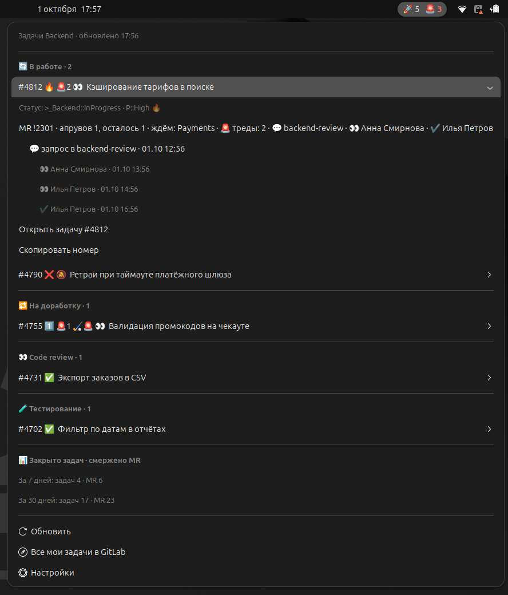

# Raketa Tasks — GNOME Shell extension



Кнопка в верхней панели со списком моих задач Raccoons из GitLab, сгруппированных
по статусу (В работе → На доработку → TODO → Code review → Тестирование → Сбор апрувов → Остальное). Перед
названием — значок приоритета (🔥 P::High, 1️⃣ P::1), у каждой задачи — статус, приоритет,
костыли, MR с апрувами и неразрешёнными тредами.

- В панели: `🚀 8` — активных задач, `🚨 3` — неразрешённых тредов в неапрувнутых MR.
- Бейджи у задачи: `🚨N` треды, `❌` упал последний пайплайн открытого MR, `🏑` костыль (`🏑🚨` — костыль для тестов, убрать перед мержем), `✅` все MR апрувнуты.
- У неапрувнутого MR — секции CODEOWNERS, чей апрув ещё нужен: `ждём: SavageBeavers, QA`. Секция закрыта, когда
  закрыты все её правила, — так же считает GitLab (апрув от любого владельца пути, включая соседние группы).
- Запросы апрува из Mattermost: у MR — `💬 raccons-review` (под ним — ссылки на сами сообщения) или
  `🔕 апрув не запрошен`; у задачи — бейдж `🔕`, если хоть один её MR ждёт апрува без запроса (см. ниже).
- Ход ревью по реакциям на запрос: `👀 Имя` — ревьюер начал смотреть (поставил :eyes:, но ещё не :white_check_mark:),
  `✔️ Имя` — отметил галочкой. Под запросом — кто и когда поставил реакцию; у задачи с неапрувнутым MR, который
  сейчас смотрят, — бейдж `👀`. Какие эмоджи что значат — в настройках.
- Клик по MR / «Открыть задачу» — браузер; «Скопировать номер» — в буфер.
- У MR с упавшим пайплайном — `❌ пайплайн` и строка со ссылкой на пайплайн. Берётся `headPipeline` MR
  в том же GraphQL-запросе, лишних запросов нет; пока пайплайн перезапущен и идёт, значок не показывается.
- Уведомления: новая задача, смена статуса, новые треды, упавший пайплайн, апрув MR, начало ревью — кто-то поставил 👀
  на запрос апрува (клик по уведомлению открывает ссылку).
- Статистика в меню за скользящие 7 и 30 дней: сколько задач команды закрыто (вы среди исполнителей)
  и сколько ваших MR смержено. Задача закрывается при мерже MR, а не после тестирования; задачи,
  где вы соисполнитель, тоже считаются.
- Обновление раз в N минут (по умолчанию 5) и пунктом «Обновить».

## Откуда данные

Расширение самодостаточно: `gitlab.js` вызывает `glab api --hostname <хост>` (токен glab из keyring)
— сначала `user`, чтобы узнать логин, затем один GraphQL-запрос за открытыми work items с лейблом
команды, их лейблами и `closingMergeRequests` (с правилами апрува `approvalState.rules`); в том же
запросе — `count` закрытых задач (`closedAfter`) и смерженных MR (`mergedAfter`) для статистики.
Правила группировки — в `groupOf()` / `toTask()`.

`--hostname` обязателен: вне git-репозитория (а gnome-shell работает из `~`) glab по умолчанию
идёт на gitlab.com и получает 401.

Хост, проект и команда (лейбл и префикс статусов `>_Команда::…`) — в настройках.

### Запросы апрува в Mattermost

`mattermost.js` **только читает** Mattermost (все запросы — `GET` к API v4): находит ваши сообщения в каналах
ревью (`coreteam-review`, `locomotives-review`, `raccons-review`, `beavers-review` — настраивается)
со ссылкой `https://<хост GitLab>/<проект>/-/merge_requests/<iid>` и сопоставляет их с MR задач.
Первое обновление пролистывает каналы на N дней назад (по умолчанию 30), следующие берут только изменения
(`?since=`), поэтому отредактированные и удалённые сообщения тоже учитываются. Реакции приходят в том же ответе
(`metadata.reactions`, с `create_at` и `user_id`), а постановка реакции обновляет `update_at` поста — `since` её
тоже видит, отдельных запросов нет; имена ревьюеров — `GET /users/{id}` с кешем. Свои реакции не учитываются.
Уведомление о 👀 приходит не позже чем через интервал обновления. «Не запрошен» показывается
только для открытых, не draft и не апрувнутых MR, и только когда Mattermost ответил без ошибок.

Personal Access Token на сервере отключён, а вход идёт через OpenID, поэтому используется токен сессии — cookie
`MMAUTHTOKEN` (DevTools → Application → Cookies → адрес сервера Mattermost). Он вставляется в настройках
расширения и хранится в keyring (libsecret, атрибут `url`). Живёт, пока жива сессия: после «Выйти» в браузере
или по истечении срока в меню появится `⚠ Mattermost: токен недействителен` — вставьте новый. Ошибки
Mattermost не мешают показу задач. Пустое поле «Сервер» (по умолчанию) — интеграция выключена.

## Установка

Нужны GNOME Shell 46 и [`glab`](https://gitlab.com/gitlab-org/cli) — GitLab CLI:

- `glab` должен быть установлен и залогинен на хост из настроек: `glab auth login --hostname <хост GitLab>`,
  проверка — `glab auth status --hostname <хост GitLab>`. Токен берёт сам glab,
  расширение его не хранит и не читает.
- `glab` ищется в `PATH` процесса gnome-shell, а не терминала. Если он лежит в `~/.local/bin`, `~/go/bin`,
  Homebrew и т.п., shell может его не увидеть — поставьте `glab` в системный каталог (`/usr/bin`,
  `/usr/local/bin`) или сделайте туда симлинк.
- Без `glab` расширение не падает: в панели `🚀 ⚠`, в меню — текст ошибки, попытка повторяется по таймеру.

```bash
make install     # компилирует схему и симлинкает каталог в ~/.local/share/gnome-shell/extensions
# X11: Alt+F2 → r → Enter; Wayland: выйти и зайти
make enable
```

Настройки: пункт «Настройки» в меню или `gnome-extensions prefs raketa-tasks@pastila`.

### Команды make

| Команда | Что делает |
|---|---|
| `make schemas` | Компилирует `schemas/*.gschema.xml` в `schemas/gschemas.compiled` (`glib-compile-schemas`). Нужна после правки схемы настроек; `install` и `pack` вызывают её сами. |
| `make install` | `schemas` + симлинк рабочего каталога в `~/.local/share/gnome-shell/extensions/raketa-tasks@pastila`. Shell подхватит расширение после перезапуска (X11: Alt+F2 → r; Wayland: перелогиниться). |
| `make enable` | Включает расширение (`gnome-extensions enable`). |
| `make uninstall` | Выключает расширение (ошибка игнорируется, если оно уже выключено) и удаляет симлинк. Сохранённые настройки остаются в dconf. |
| `make pack` | `schemas` + собирает `raketa-tasks@pastila.shell-extension.zip` (`gnome-extensions pack`, с `gitlab.js` и схемой). Архив ставится без симлинка: `gnome-extensions install --force raketa-tasks@pastila.shell-extension.zip`. В git не попадает. |
| `make logs` | Следит за журналом gnome-shell (`journalctl --user -f`) и показывает строки, где есть «raketa»: `console.warn` расширения и JS-ошибки с путём к его файлам. Выход — Ctrl+C. |

## Разработка

Каталог установлен симлинком, так что после правки достаточно перезапустить shell (X11: Alt+F2 → r).
Логи: `make logs` (`console.warn` расширения и ошибки JS).

Проверить без перезапуска своей сессии можно в отдельном headless-shell:

```bash
dbus-run-session -- gnome-shell --headless --wayland --no-x11 --virtual-monitor 1600x1000
```

с `XDG_DATA_HOME`/`XDG_CONFIG_HOME` во временном каталоге, `GSETTINGS_BACKEND=keyfile` и коротким
`XDG_RUNTIME_DIR` (путь к wayland-сокету ≤ 108 байт). Keyring там недоступен, поэтому в `PATH` кладётся фейковый
`glab`, отдающий сохранённые ответы `user` и `graphql`. Для `org.gnome.Shell.Eval` нужен
unsafe-mode — его включает вспомогательное расширение с `global.context.unsafe_mode = true`;
в Eval доступен `Main` (`Main.panel.statusArea['raketa-tasks@pastila']`).

`mattermost.js` зависит только от `gi://` и запускается в обычном `gjs -m` — удобно проверять
против мок-сервера на Python, отдающего `users/me`, `users/me/teams/…/channels` и `channels/…/posts`.
